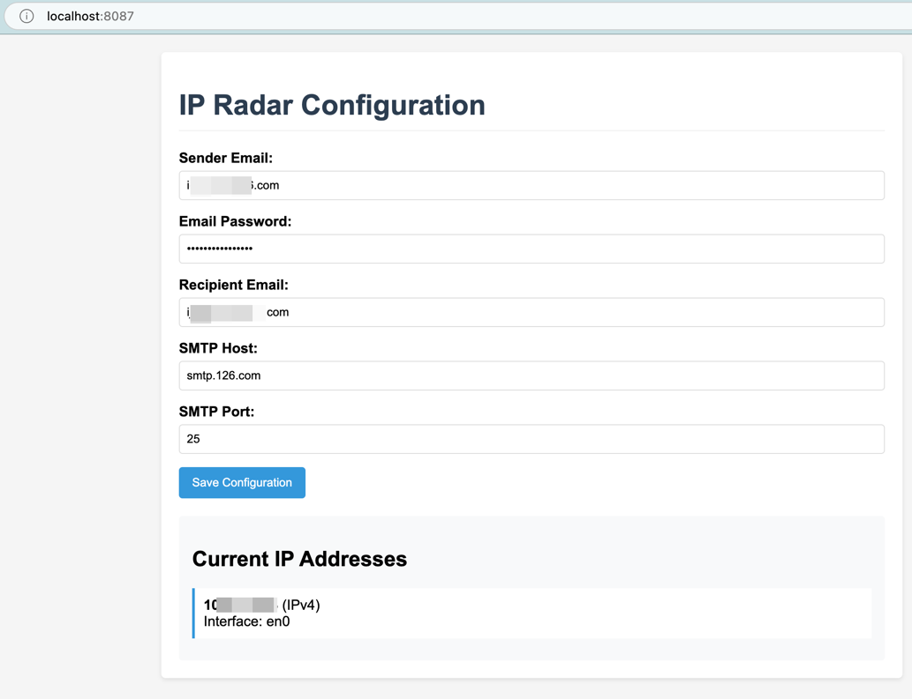
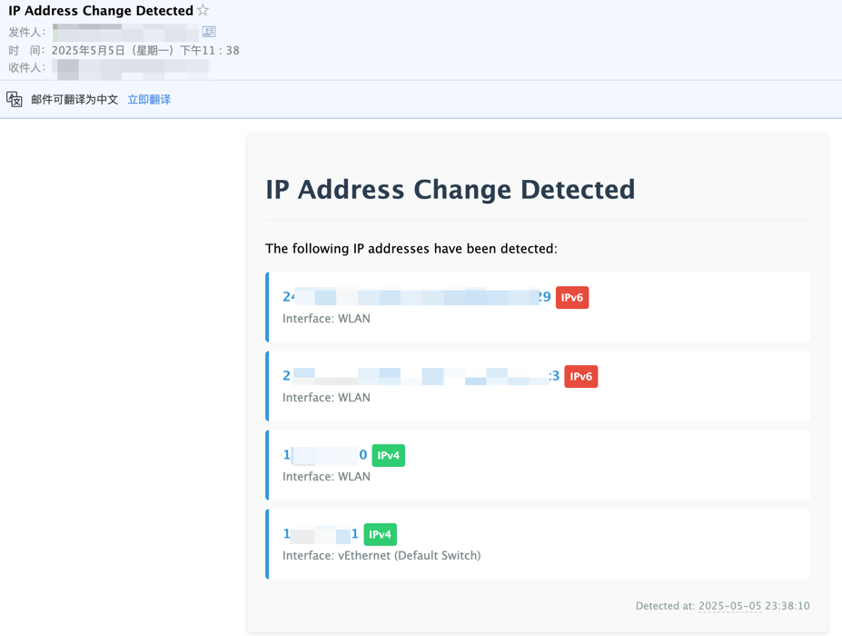

<p align="right">
  <a href="readme.md">English</a> |
  <a href="readme_cn.md">简体中文</a>
</p>

# IP Radar - Network IP Monitoring Tool

## Project Description

A network monitoring tool written in Go that detects IP address changes on local network interfaces and sends notifications via email.

## Features

- Automatically detects IP address changes on local network interfaces
- Supports both IPv4 and IPv6 addresses
- Sends beautifully formatted HTML email notifications via SMTP
- Built-in web configuration interface (port 8087)
- Automatically creates default configuration file
- Checks for IP changes every 10 minutes

## Installation Guide

### Prerequisites

- Go 1.20 or higher
- Valid SMTP email configuration

### Installation Steps

1. Clone or download the project code
2. Ensure Go environment is properly configured
3. Run the following commands to install dependencies and build the program:

   ```
   go mod init ip-radar
   go build
   ```

## Usage

1. On first run, the program will automatically create a `config.json` configuration file
2. Access the SMTP email settings via browser at [http://localhost:8087](http://localhost:8087)
3. The program will automatically run and monitor IP address changes

## Configuration

The configuration file `config.json` contains the following fields:

```
{
  "email": {
    "from": "Sender email",
    "password": "Email password/authorization code",
    "to": "Recipient email",
    "smtpHost": "SMTP server address",
    "smtpPort": "SMTP port"
  }
}
```

## Code Structure

```
main.go - Main program file
config.json - Configuration file (auto-generated)
```

## FAQ

### Why can't my IP address be detected?

The program skips the following types of IP addresses:

- Loopback addresses (127.0.0.1, etc.)
- Link-local addresses
- Private addresses (10.0.0.0/8, etc.)
- Virtual interfaces (VMware, VirtualBox, etc.)

### How to change the check frequency?

Modify the `time.Sleep(10 * time.Minute)` parameter in the `main()` function

### Why am I not receiving email notifications?

Please check:

1. Whether SMTP configuration is correct
2. Whether SMTP service is enabled for your email account
3. Whether notifications are being classified as spam





## License
MIT